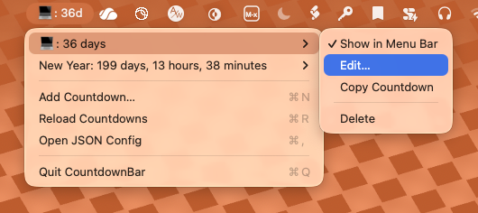

# CountdownBar

A tiny native macOS menu bar app for tracking multiple countdowns. One countdown is shown directly in the menu bar; all countdowns are visible from the menu bar dropdown.

## Features

- Shows the selected countdown in the macOS menu bar.
- Lists all countdowns in the dropdown menu.
- Add, edit, delete, and copy countdowns.
- Choose which countdown appears in the menu bar.
- Per countdown, choose one of three display modes: exact time remaining, whole days remaining, or percent remaining.
- Percent remaining uses configurable start and target dates.
- Stores countdowns as JSON at:

  ```text
  ~/Library/Application Support/CountdownBar/countdowns.json
  ```



## Develop

Run directly from Swift Package Manager:

```bash
swift run CountdownBar
```

Build a `.app` bundle:

```bash
./scripts/build-app.sh
open .build/CountdownBar.app
```

## JSON format

```json
[
  {
    "id": "2B1F1C35-5C61-4D1E-BD5C-1D7961270B52",
    "title": "Launch day",
    "startDate": "2026-06-15T12:00:00Z",
    "date": "2026-09-01T12:00:00Z",
    "showInMenuBar": true,
    "displayMode": "percentRemaining"
  }
]
```

Exactly one countdown is kept selected for the menu bar. If none is selected, CountdownBar selects the first countdown automatically.

`displayMode` can be `exactTime`, `wholeDays`, or `percentRemaining`.

`startDate` can be configured when creating or editing a countdown. Percent remaining is calculated as `100 * (end - now) / (end - start)`, clamped to `0...100`, and shown as a whole percentage.

For date-only modes, both `startDate` and `date` are normalized to noon, and the app requires the start date to be earlier than or equal to the target date. Older config files using `includeTime` still load and are migrated automatically.

## Future Work

- hunt down and correct a calculation error. Time is now 2026-06-15T11:32 and the program calculates that New Year is in 199 days, 13 hours, and 26 minutes, where that is actually circa one hour after midnight.

## License

CountdownBar is released under the MIT License. See [LICENSE](LICENSE).
